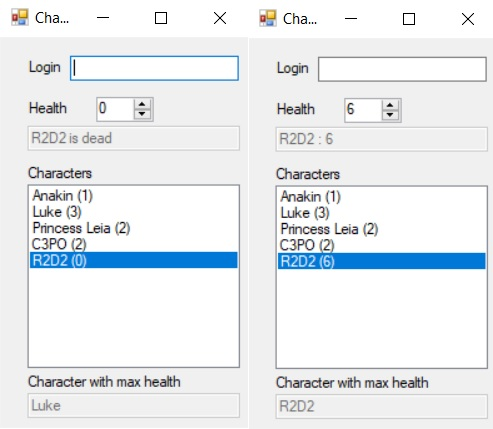

# Encapsulation

Exercise in c# for encapsulation in Object Oriented Programming.

The goal was to create a **graphic interface** :
* to add *Characters* to a listbox,
* to update *Characters* health in function of the value given to them,
* to show the *Character* with the max life.

